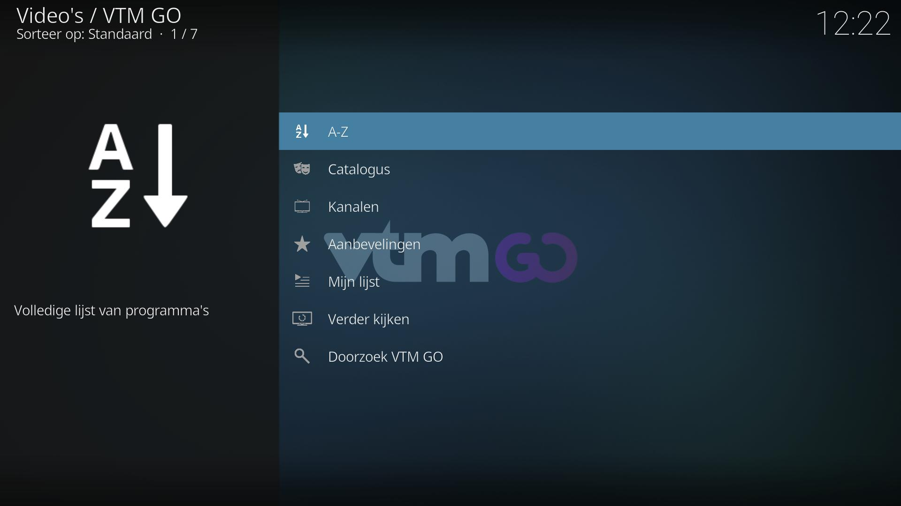
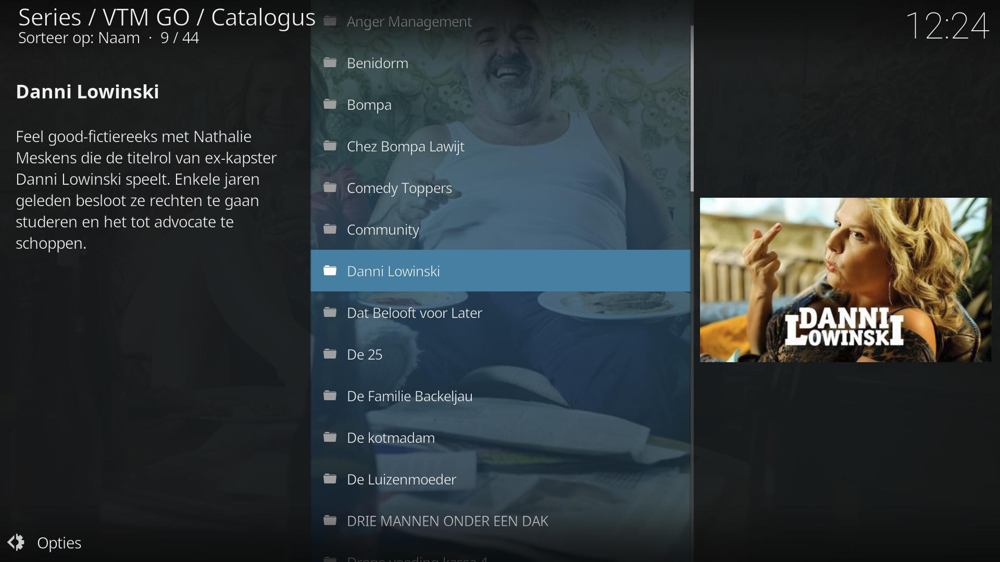
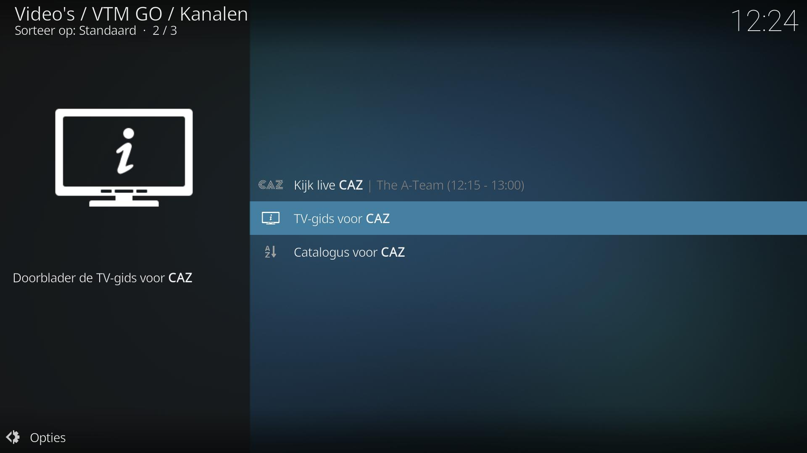

# VTM GO Kodi Add-on

*plugin.video.vtm.go* is a Kodi add-on for watching live video streams and video-on-demand content available on the VTM GO platform. 

> Note: You will need to create an account and a profile first on the [VTM GO website](https://vtm.be/vtmgo). This add-on will also play the advertisements that are added to the streams by VTM GO.

## Features
De volgende features worden ondersteund:

* Kijk live TV (VTM, VTM 2, VTM 3, VTM 4, CAZ 2, VTM Kids & QMusic)
* Kijk on-demand content (films en series)
* Doorblader de VTM GO aanbevelingen and "Mijn lijst"
* Bekijk en speel rechtstreeks vanaf de TV gids
* Doorzoek de catalogus
* Bekijk YouTube-filmpjes van enkele DPG Media kanalen
* Gebruikersprofielen (VTM GO or VTM GO Kids)
* Integratie met [IPTV Manager](https://github.com/add-ons/service.iptv.manager)
* Integratie met Kodi bibliotheek

## Screenshots

<table>
  <tr>
    <td></td>
    <td></td>
    <td></td>
  </tr>
 </table>

## Disclaimer

This add-on is not officially commissioned/supported by DPG Media and is provided 'as is' without any warranty of any kind.
The VTM GO name, VTM GO logo, channel names and icons are property of DPG Media and are used according to the fair use policy.
